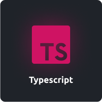
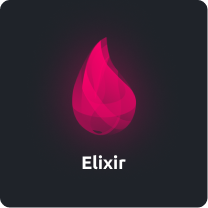

 #  Hi, my name is Ian!

### 🔭 I'm a Student

### ✨ Take a look at my projects to see what I can do.

### 📫 Want to contact me? Send me an email! **goldfeld34@gmail.com**

### 🔥 Techs that I use:

  
  
  
  

### ☄ Stats

  

  

